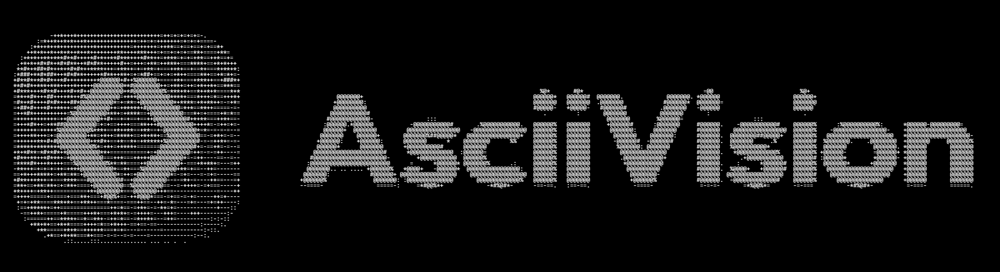
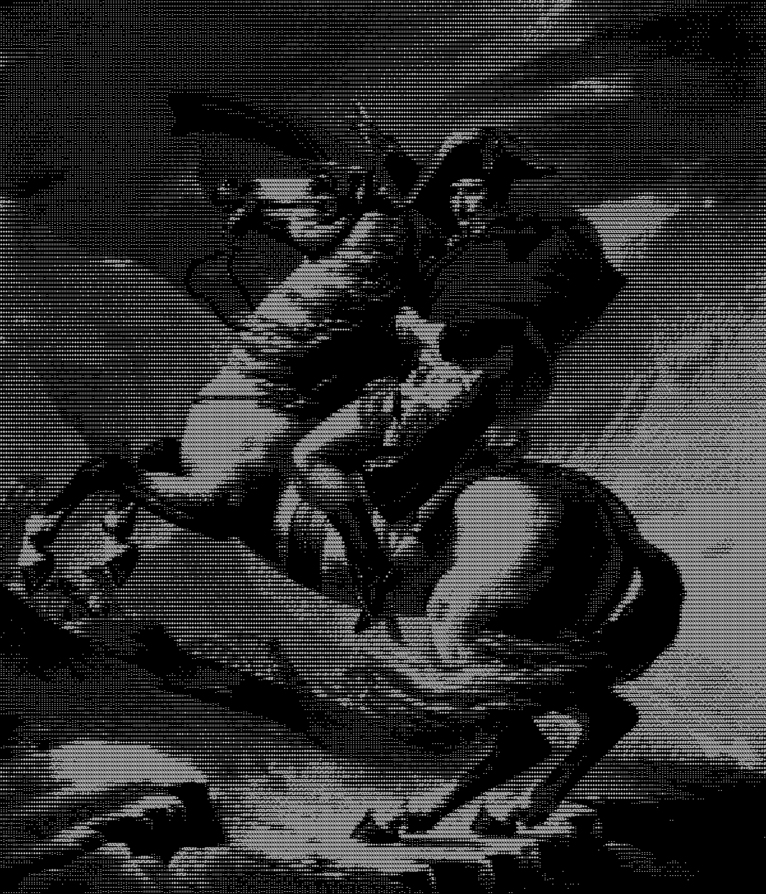
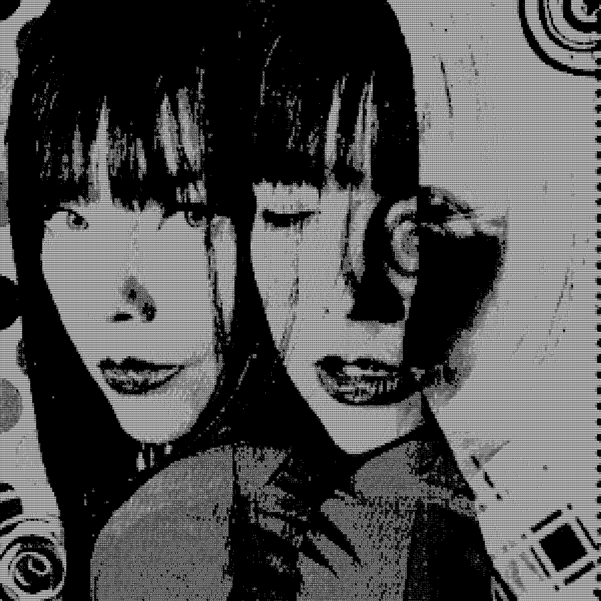
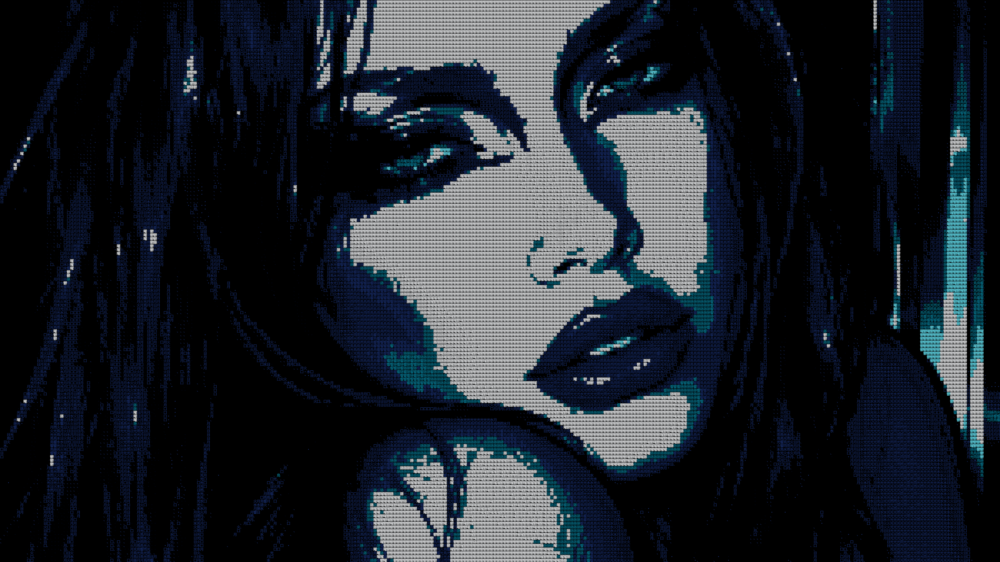
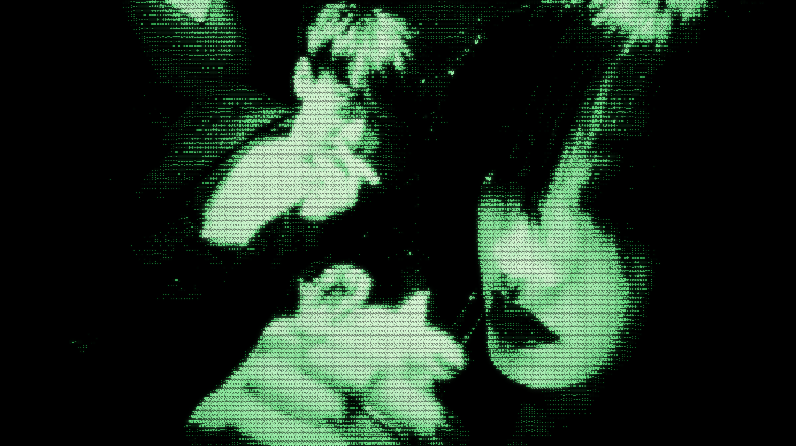

  

---

**ASCII and Unicode glyph art converter with neon effects, creative controls, and real-time rendering.**

## What It Does

AsciiVision converts images into ASCII-style text art with multiple rendering modes, color support, and advanced image processing. It has a Default keyboard-symbol ASCII mode plus English, Japanese, Chinese, Hindi, Russian, and Arabic glyph sets. Language modes use Unicode glyph art where needed.

## Quick Start

1. **Upload an image** — Click, paste, or drag-drop into the input area
2. **Adjust settings** (optional) — Tweak brightness, contrast, sharpness
3. **Choose glyph language** — Default, English, Japanese, Chinese, Hindi, Russian, or Arabic
4. **Choose rendering mode** — Classic, Neon, Scanline, or Single Char
5. **Export** — Copy to clipboard, download as TXT or PNG

## Recommended Settings (Optimized)

These settings provide the best balance for most images:

| Setting | Value | Why |
|---------|-------|-----|
| Output Width | 300 | High detail, reasonable file size |
| Brightness | 1.20 | Slightly punchy, visible details |
| Contrast | 2.00 | Sharp tonal separation |
| Gamma | 1.20 | Natural midtone curve |
| Glyph Language | Default | Classic keyboard-symbol ASCII baseline |
| Sharpness | 0.00 | Clean baseline (increase if blurry) |
| Aspect Ratio | Auto | Preserves the uploaded image shape |
| Dithering | ✓ ON | Smoother tonal gradation |
| Invert Character Ramp | ✓ ON | Natural light/dark mapping |
| Colored Output | ✗ OFF | Grayscale for contrast |
| Color Palette | Source Colors | Uses original image colors when color is enabled |

  

## Control Breakdown

### BASIC Tab

**Output Width** (20-300 chars)
- Lower = blockier, faster
- Higher = finer detail, larger file
- Default: 300 (high-detail first render)

**Brightness** (0-2)
- Adjusts overall image lightness
- 1.0 = original
- Default: 1.2 for punchy visible detail

**Contrast** (0-2)
- Separates light and dark areas
- Higher = more dramatic
- Default: 2.0 for high-impact ASCII

## Glyph MODES

**Glyph Language**
- Default, English, Japanese, Chinese, Hindi, Russian, Arabic
- Default is the original symbol ramp (@, #, %, *, etc.)
- English uses alphabet glyphs instead of the symbol ramp
- Each language uses its own density ramp and font stack
- Switching language also adjusts the default aspect correction for that script

  

**Character Ramp**
- Default-only ramp presets: Strong, Detailed, Blocks, Minimal
- Language scripts use their language-specific ramp

---

### ADVANCED Tab

**Gamma** (0.5-2)
- Adjusts midtone response
- 1.0 = linear
- Default: 1.2 for a natural curve

**Sharpness** (0-2)
- 0 = soft/smooth
- 0.5+ = detail enhancement
- Increase if image looks blurry

**Aspect Ratio** (0.5-3)
- Corrects stretched/squished look
- Default: auto source-preserving correction
- Adjust based on your font

**Dithering (Floyd-Steinberg)**
- Adds noise/pattern for smoother tones
- Default: ON
- Better gradation with fewer characters
- Useful for complex images

---

### Colored MODES

**Colored Output**
- Maps original RGB to colored ASCII
- Default: OFF
- Off = grayscale (sharper contrast)
- On = artistic multi-color look

**Color Palette**
- Source Colors, Black & White, Terminal Green, Amber CRT, Game Boy, Cyberpunk, Sepia, Warm, Cool
- Source Colors keeps the original image colors
- Palette presets snap every glyph color to the closest color in the selected palette
- Choosing a palette preset automatically enables Colored Output

  

**Invert Character Ramp** ✓ DEFAULT
- Inverts dark ↔ light mapping
- Should stay ON for best results
- Off only for artistic inversion

---

### MODES Tab

**Rendering Modes**

- **CLASSIC** — Full character ramp (@%#*+=-:. ) — Best for detail
- **SINGLE CHAR** — Uses one glyph (@, 日, 龍, भ, Ж, ض, etc.) with variable density — Minimal, bold look
- **SCANLINE** — Horizontal line pattern (⎯) — Retro CRT effect
- **NEON** — RGB color output with glowing effect — Vibrant, cyberpunk style

### NEON Mode Controls

**Neon Palette** (MATRIX, CYAN, PURPLE, PINK, BLUE, RED, EMBER)
- Color scheme for the glow effect
- MATRIX (green) = default cyberpunk
- RED and EMBER use richer luminance-based gradients for deeper shadows and brighter highlights

**Glow Intensity** (0-2)
- 0 = no glow (flat color)
- 1.0 = subtle glow
- 1.8-2.5 = heavy glow (PNG export recommended)

**Bloom** (0-2)
- Adds a washed CRT/Y2K flash look to neon colors
- 0 = off
- Higher values push colors toward paler highlights with a restrained aura
- MATRIX + Bloom creates a softer phosphor-green terminal look

  

## Export Options

**Copy** — Clipboard text (ASCII symbols for Default, Unicode text for language scripts)
**TXT** — Download plain text file
**PNG** — Download as high-quality image (includes glow and bloom effects)

## How It Works

1. **Downsampling** — Image reduced to target width
2. **Luminance Mapping** — Each pixel converted to brightness value
3. **Auto-Contrast** — Min-max normalization for punch
4. **Sharpening** — Optional convolution filter
5. **Dithering** — Floyd-Steinberg error diffusion (optional)
6. **Glyph Mapping** — Brightness mapped to the selected language ramp
7. **Color Mapping** — RGB, palette preset, or neon values assigned to each character
8. **Bloom Wash** — Optional CRT/Y2K flash-style color wash for neon mode
9. **Glow Rendering** — Multi-layer shadow effects (PNG export)

## Tips & Tricks

- **High contrast images** work best (portraits, logos, silhouettes)
- **Increase width** for finer detail, decrease for speed
- **Adjust contrast first**, brightness second
- **Neon mode + PNG export** = stunning wall-worthy art
- **Matrix + Bloom** = softer old-terminal phosphor glow
- **Red/Ember palettes** = gradient neon with stronger highlight depth
- **Color Palette presets** = cleaner, poster-like output with fewer colors
- **Enable dithering** for photos with lots of gradients
- **Disable dithering** for clean, bold graphic images
- **Single Char mode** = minimal zen aesthetic
- **Japanese/Chinese glyphs** work best at medium widths because the characters are wider than Latin monospace
- **Arabic TXT export** may display differently in bidi-aware text editors; PNG export preserves the app's left-to-right grid rendering

## Built With

- React + TypeScript
- Vite (fast builds)
- TailwindCSS (styling)
- Canvas API (rendering & export)

## License

Public domain — Use, modify, distribute freely. No restrictions.

## Contribute

Found an issue? Have an idea? Submit a PR to [github.com/ah4ddd/ascii-vision](https://github.com/ah4ddd/ascii-vision)

---

**Made with ❤️ for ASCII enthusiasts**
